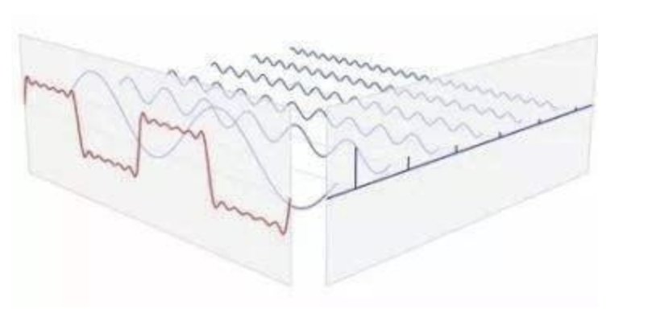

# 3.7 图像变换-傅里叶变换

**学习目标**

- 理解傅里叶变换
- 知道傅里叶变换的相关概念
- 知道傅里叶变换的分类
- 知道怎么在图像中进行傅里叶变换
- 了解傅里叶变换在图像应用中的意义
- 知道在OPenCV中怎么实现傅里叶变换
- 了解频域滤波的分类

---

# 1 傅里叶变换的理解

傅里叶变换是由法国的一位数学家Joseph Fourier在18世纪提出来的，他认为：**任何连续周期的信号都可以由一组适当的正弦曲线组合而成**。


傅里叶变换是描述信号的需要，它能够反映信号的特征，并可以使用特征值进行量化，比如正弦波可以使用幅值和频率进行描述。下面这幅图是变压器空载电流的输入波形：


它看起来和正弦波很相近，但很难定量的描述其特征，采用傅里叶变换后，得到下述的频谱图（幅值）：


从该频谱图中可以清楚的看到，主要包括3，5，7，9次谐波，我们就可以对原信号进行描述。

傅里叶变换是一种信号分析方法，它使我们能够对信号的构成和特点进行深入和定量的研究，把信号通过频谱的方式进行准确的、定量的描述。

那我们为什么要把信号分解为正弦波的组合，而不是其他波形呢？

傅里叶变换是信号的分析方法，目的就是要简化问题，而不是将其变复杂，傅里叶选择了正弦波，而没有选择其他波形，是因为正弦波有任何其他波形不具有的特点：**正弦波输入至任何线性系统中，不会产生新的频率成分，输出的仍是正弦波，改变的仅仅是幅值和相位**。用单位幅值的不同频率的正弦波输入至某线性系统，记录其输出正弦波的幅值和频率的关系，就得到该系统的幅频特性，记录输出正弦波的相位和频率的关系，就得到该系统的相频特性。线性系统是自动控制研究的主要对象，我们只要研究系统对正弦波的输入输出关系，就可以知道该系统对任意输入信号的响应。这是傅里叶变换的最主要的意义。

# 2 傅里叶变换中相关概念

## 2.1 时域和频域

傅里叶变换是将难以处理的时域信号转换成易于分析的频域信号，那频域和时域到底是什么呢？

**时域**：时域是真实的世界，是唯一存在的域。从我们出生开始，所接触的这个世界就是随着时间在变化的，如花开花落，四季变换，生老病死等。以时间作为参照来分析动态世界的方法我们称其为时域分析。

比如说一段音乐，就是一个随时间变化的震动，这就是时域的表示，如下图：


**频域**：**频域它不是真实的，而是一个数学构造。**频域是一个遵循特定规则的数学范畴，也被一些学者称为上帝视角。结合上面对时域的理解，如果时域是运动永不停止的，那么频域就是静止的。
	正弦波是频域中唯一存在的波形，这是频域中最重要的规则，**即正弦波是对频域的描述，因为频域中的任何波形都可用正弦波合成**。

在看上面那段音乐，我们可以将其表示成频域形式，就是一个永恒的音符。

而对于信号来说，信号强度随时间的变化规律就是时域特性，信号是由哪些单一频率的信号合成的就是频域特性,傅里叶变换实质就是是频域函数和时域函数的转换。

那频域与时域之间的关系是什么样的呢？利用正弦函数的叠加成一个矩形，不仅仅是矩形，你能想到的任何波形都是可以如此方法用正余弦波叠加起来的。如下图所示，时域是永远随着时间的变化而变化的，而频域就是装着装着正余弦波的空间。


从时域来看，我们会看到一个近似为矩形的波，而我们知道这个矩形的波可以拆分为一些正弦波的叠加。而从频域方向来看，我们就看到了每一个正余弦波的幅值，每两个正弦波之间都还有一条直线，那并不是分割线，而是振幅为 0 的正弦波！也就是说，为了组成特殊的曲线，有些正弦波成分是不需要的。随着叠加的递增，所有正弦波中上升的部分逐渐让原本缓慢增加的曲线不断变陡，而所有正弦波中下降的部分又抵消了上升到最高处时继续上升的部分使其变为水平线。一个矩形就这么叠加而成了。

我们看下面的动图理解，如下所示：




## 2.2 频谱和相位谱

在傅里叶变换中怎么描述变换后的结果呢？有两个概念：频谱和相位谱。

**频谱**：将信号分解为若干不同频率的正弦波，那么每一个正弦波的幅度，就叫做频谱，也叫做幅度谱。


**相位谱**：频谱只代表了一个正弦函数的幅值，而要准确描述一个正弦函数，我们不仅需要幅值，还需要相位，不同相位决定了波的位置，所以对于频域分析，仅仅有频谱（振幅谱）是不够的，我们还需要一个相位谱


如上图所示：**投影点我们用粉色点来表示，红色的点表示离正弦函数频率轴最近的一个峰值，而相位差就是粉色点和红色点水平距离。将相位差画到一个坐标轴上就形成了相位谱**

# 3 傅里叶变换

根据原信号的属性，我们可以将傅里叶变换分为以下几种：


在实际应用较多的是傅里叶变换、傅里叶级数离散傅里叶变换，我们对其进行分别介绍。

任意波形都可以通过正弦波的叠加来表示，正弦波可以通过欧拉公式写成指数的形式，欧拉公式如下：
$$
e^{it}=\cos(t)+i\sin(t)
$$
所以以下内容都是以指数形式进行展示。

## 3.1 傅里叶级数

任意的周期连续信号都可以使用正弦波叠加而成，这叫做傅里叶级数，写成指数形式如下所示：
$$
f(t) = \sum_{-\infty}^{\infty}c_ne^{i\frac{2\pi nt}t }dt
$$
其中$$c_n$$表示傅里叶级数：
$$
c_n=\frac{1}{T}\int_{-\frac{T}{2}}^{\frac{T}{2}}f(t)e^{-i\frac{2\pi nt}t }dt
$$
公式中的T表示时域信号的周期。从上式中可以看出周期信号的频谱是离散的非周期信号。


## 3.2 傅里叶变换

对于非周期的连续信号，也可以使用正弦信号来逼近，这时我们将非周期信号看做周期无限大的周期信号，则有：
$$
F(\omega) = \int_{-\infty}^{\infty}f(t)e^{-i\omega t}dt
$$
其中，$$\omega$$表示频率，t表示时间。我们叫做傅里叶变换。从中可以看出非周期信号的频谱是连续的非周期信号。


逆变换为：
$$
f(t) = \frac{1}{2\pi}\int_{-\infty}^{\infty}F(\omega)e^{i\omega t}dw
$$
利用上述公式就可将频域信号转换为时域信号。

## 3.3 离散傅里叶变换（DFT）

由于数字信号处理是希望在计算机上实现各种运算和变换，其所涉及的变量和运算都是离散的，因此对于数字信号处理，应该找到在时域和频域都是离散的傅里叶变换，即离散傅里叶变换。

对于非周期的离散信号进行傅里叶变换就是离散傅里叶变换，其计算方法如下所示：	
$$
F(k)= \sum_{n=0}^{N-1}f(n)e^{-i\frac{2\pi kn}{N}}
$$
其中N表示傅里叶变换的点数，k表示傅里叶变换的频谱。

逆变换为：
$$
f(n) = \frac{1}{N}\sum_{k=0}^{N-1}F(k)e^{ikn\frac{2\pi}{N}}
$$

# 4 傅里叶变换在图像中的应用

## 4.1 图像中的傅里叶变换

图像是二维的离散信号，所以我们在对图像进行二维傅里叶变换。对于M*N的一幅图像的离散二维傅里叶变换，公式如下：
$$
F(u,v) = \sum_{x=0}^{M-1}\sum_{y=0}^{N-1}f(x,y)e^{-i2\pi(\frac{ux}M+\frac{vy}N)}
$$
其中u和v确定频率，f(x,y)是灰度值，该式的意义是两个求和号对图像进行遍历，f(x,y)取出原像素的数值，当固定x时，横轴不动，对y进行遍历时，$$\frac{vy}{N}$$表示变换前像素的位置比例与变换后的位置相乘，映射到新的位置，且能够反映像素沿y方向距离的差异，越靠后的像素(y越大)$$\frac{vy}{N}$$值越大，即$$\frac{vy}{N}$$能够反映出不同位置(纵轴)像素之间的差异；前一项含义为保留像素相对位置(横轴)的信息(遍历y时为常数)，2π为修正参数。

逆变换由下式给出：
$$
f(x,y) = \sum_{x=0}^{M-1}\sum_{y=0}^{N-1}F(u,v)e^{i2\pi(\frac{ux}M+\frac{vy}N)}
$$


## 4.2 图像傅里叶变换的物理意义


###### 图像的频率是表征图像中灰度变化剧烈程度的指标，是灰度在平面空间上的梯度。如：大面积的沙漠在图像中是一片灰度变化缓慢的区域，对应的频率值很低；而对于地表属性变换剧烈的边缘区域在图像中是一片灰度变化剧烈的区域，对应的频率值较高。傅里叶变换在实际中有非常明显的物理意义，从物理效果看，傅里叶变换是将图像从空间域转换到频率域，其逆变换是将图像从频率域转换到空间域。换句话说，傅里叶变换的物理意义是将图像的灰度分布函数变换为图像的频率分布函数。

###### 傅里叶逆变换是将图像的频率分布函数变换为灰度分布函数。

我们在做DFT时是将图像的空域和频域沿x和y方向进行无限周期拓展的，如下图所示：


如果只取其中一个周期，会得到：


为了便于频域的滤波和频谱的分析，常在变换后进行频谱的中心化，即对掉频谱的四个象限，如下图所示：


经中心化后的频谱为：


在经过频谱居中后的频谱中，中间最亮的点是最低频率，属于直流分量，越往外，频率越高，如下所示：


## 4.3 在opencv中实现图像的傅里叶变换

在OPenCV中实现图像的傅里叶变换，使用的是：

正变换：

```python
dft = cv2.dft(src, dst=None)
```

参数：

- src: 输入图像，要转换成np.float32格式
- dst:参数是可选的, 决定输出数组的大小。默认输出数组的大小和输入图像大小一样。如果输出结果比输入图像大，输入图像就需要在进行变换前补 0。如果输出结果比输入图像小的话，输入图像就会被切割。

返回：

- dft: 傅里叶变换后的结果，有两个通道，第一个通道是结果的实数部分，第二个通道是结果的虚数部分。我们需要在此基础上计算傅里叶变换的频谱和相位。

逆变换：

```python 
img = cv.idft(dft)
```

参数：

- dft: 图像的频域表示

返回：

- img: 图像的空域表示

实现：

```python 
import numpy as np 
import cv2 as cv
from matplotlib import pyplot as plt
# 1 读取图像
img = cv.imread('./image/deer.jpeg',0)
# 2 傅里叶变换
# 2.1 正变换
dft = cv.dft(np.float32(img),flags = cv.DFT_COMPLEX_OUTPUT) 
# 2.2 频谱中心化
dft_shift = np.fft.fftshift(dft)
# 2.3 计算频谱和相位谱
mag, angle = cv.cartToPolar(dft_shift[:,:,0], dft_shift[:,:,1], angleInDegrees=True)
mag=20*np.log(mag)
# 3 傅里叶逆变换
# 3.1 反变换
img_back = cv.idft(dft)
# 3.2 计算灰度值
img_back = cv.magnitude(img_back[:,:,0],img_back[:,:,1])

# 4 图像显示
plt.figure(figsize=(10,8))
plt.subplot(221),plt.imshow(img, cmap = 'gray') 
plt.title('输入图像'), plt.xticks([]), plt.yticks([]) 
plt.subplot(222),plt.imshow(mag, cmap = 'gray')
plt.title('频谱'), plt.xticks([]), plt.yticks([]) 
plt.subplot(223),plt.imshow(angle, cmap = 'gray')
plt.title('相位谱'), plt.xticks([]), plt.yticks([])
plt.subplot(224),plt.imshow(img_back, cmap = 'gray')
plt.title('逆变换结果'), plt.xticks([]), plt.yticks([])
plt.show()
```

结果展示：


## 4.4 频域滤波

###### 图像变换到频域后，就可以进行频域滤波，主要包括：高通滤波，低通滤波，带通滤波和带阻滤波。

### 1 高通和低通滤波器

###### 我们知道，图像在经过傅里叶变换后，经频谱中心化后，从中间到外面，频率上依次是从低频到高频的。那么我们假设把中间规定一小部分去掉，是不是相对于把低频信号去掉了呢？这也就是相当于进行了高通滤波。

这个滤波模板如下图所示：


其中黑色部分为0，白色部分为1，我们将这个模板与图像的傅里叶变换相与就实现了高通滤波。如下所示：

```python
import numpy as np 
import cv2 as cv
from matplotlib import pyplot as plt
# 1 读取图像
img = cv.imread('./image/deer.jpeg',0)
# 2 设计高通滤波器(傅里叶变换结果中有两个通道，所以高通滤波中也有两个通道)
rows,cols = img.shape
mask = np.ones((rows,cols,2),np.uint8)
mask[int(rows/2)-30:int(rows/2)+30,int(cols/2)-30:int(cols/2)+30,:] = 0

# 3 傅里叶变换
# 3.1 正变换
dft = cv.dft(np.float32(img),flags = cv.DFT_COMPLEX_OUTPUT) 
# 3.2 频谱中心化
dft_shift = np.fft.fftshift(dft)
# 3.3 滤波
dft_shift = dft_shift * mask
# 3.4 频谱去中心化
dft_shift = np.fft.fftshift(dft_shift)

# 3 傅里叶逆变换
# 3.1 反变换
img_back = cv.idft(dft_shift)
# 3.2 计算灰度值
img_back = cv.magnitude(img_back[:,:,0],img_back[:,:,1])
plt.subplot(121),plt.imshow(img, cmap = 'gray') 
plt.title('输入图像'), plt.xticks([]), plt.yticks([]) 
plt.subplot(122),plt.imshow(img_back, cmap = 'gray')
plt.title('高通滤波结果'), plt.xticks([]), plt.yticks([])
plt.show()
```


从结果中可以看出，高通滤波器有利于提取图像的轮廓，图像的轮廓或者边缘或者一些噪声处，灰度变化剧烈，那么在把它们经过傅里叶变换后。就会变成高频信号（高频是捕捉细节的），所以在把图像低频信号滤掉以后剩下的自然就是轮廓了。

现在我们看下低通滤波的效果，构造一个低通滤波器很简单，只要把上述模板中的1改为0，0改为1即可。把设计高通滤波器部分的代码改成如下所示：

```python
rows,cols = img.shape
mask = np.zeros((rows,cols,2),np.uint8)
mask[int(rows/2)-30:int(rows/2)+30,int(cols/2)-30:int(cols/2)+30,:] = 1
```

低通滤波的效果如下图所示：


从结果中可看到低通滤波后图像轮廓变模糊了，图像的大部分信息基本上都保持了。图像的主要信息都集中在低频上，所以低通滤波器的效果是这样也是能够理解的。上述的高通、低通滤波器的构造有0,1构成的理想滤波器，也是最简单的滤波器，另一些其它的滤波器。比方说高斯滤波器，butterworth滤波器等等，如下图所示：


### 2 带通和带阻滤波器

我们把高通和低通的一部分结合在模板中就形成了带通滤波器，它容许一定频率范围信号通过, 但减弱(或减少)频率低于於下限截止频率和高于上限截止频率的信号的通过，如下图所示：


还是以理想的带通滤波器演示如下，将构建的滤波的代码修改如下：

```python
rows,cols = img.shape
mask1 = np.ones((rows,cols,2),np.uint8)
mask1[int(rows/2)-8:int(rows/2)+8,int(cols/2)-8:int(cols/2)+8] = 0
mask2 = np.zeros((rows,cols,2),np.uint8)
mask2[int(rows/2)-80:int(rows/2)+80,int(cols/2)-80:int(cols/2)+80] = 1
mask = mask1*mask2
```

结果如下所示：


这就是带通的效果，它既能保留一部分低频，也能保留一部分高频。至于保留多少，根据需求选择就可以了。

带阻滤波器减弱(或减少)一定频率范围信号, 但容许频率低于於下限截止频率和高于上限截止频率的信号的通过，如下示：


在代码中将设计滤波器部分改为如下所示：

```python
mask = np.ones((rows,cols,2),np.uint8)
mask[int(rows/2)+80:int(rows/2)+150,int(cols/2)-150:int(cols/2)+150] = 0
mask[int(rows/2)-150:int(rows/2)-80,int(cols/2)-150:int(cols/2)+150] = 0
mask[int(rows/2)-150:int(rows/2)+150,int(cols/2)+80:int(cols/2)+150] = 0
mask[int(rows/2)-150:int(rows/2)+150,int(cols/2)-150:int(cols/2)-80] = 0
plt.imshow(mask[:,:,1],cmap=plt.cm.gray)
```

结果如下所示:


从结果中可看到带阻滤波器保持了原图像的大部分信息，图像的主要信息都集中在低频上，而边缘轮廓信息都在高频位置。带阻滤波器滤除了中频信息，保留了低频和高频信息，所以对图像的信息破坏是比较小的。：

---

**总结：**

1. 傅里叶变换的理解

   任何连续周期的信号都可以由一组适当的正弦曲线组合而成

2. 相关概念：

   时域：以时间作为参照来分析动态世界的方法

   频域：频域它不是真实的，而是一个数学构造

   幅度谱：将信号分解为若干不同频率的正弦波，那么每一个正弦波的幅度，就叫做频谱，也叫做幅度谱

   相位谱：每一个正弦波的相位，就叫做相位谱

3. 傅里叶变换分类

   傅里叶级数：任意的周期连续信号的傅里叶变换

   傅里叶变换：非周期连续信号

   离散傅里叶变换：非周期离散信号

4. 图像中的应用

   - 二维傅里叶变换

   - 意义：将图像的灰度分布函数变换为图像的频率分布函数。

   - API：

     cv.dft()

     cv.idft()

   - 滤波：高通，低通，带通，带阻